<div align="center">

<!-- BANNER PIXELADO -->
<a href="https://github.com/daridjcm">
  <picture>
    <source media="(prefers-color-scheme: dark)" srcset="assets/banner-dark.svg">
    <source media="(prefers-color-scheme: light)" srcset="assets/banner-light.svg">
    
  </picture>
</a>

<br>

<!-- TEXTO ANIMADO -->
<a href="https://github.com/daridjcm">
  
</a>

<br>


</div>

---

## `$ whoami`

Estudiante de Ingeniería de Sistemas apasionada por la tecnología y el desarrollo de software. Creo que combinar mi formación creativa (audiovisual y diseño) con el pensamiento lógico me permite construir experiencias digitales **funcionales, visualmente atractivas y orientadas al usuario**.

<p align="center">
  <a href="https://daridjcm.vercel.app/">
    
  </a>
  <a href="https://daridjcm.vercel.app/CV.pdf">
    
  </a>
</p>

---

<div align="center">

## `$ cat tech-stack.yaml`

<table border="1" cellpadding="14">
  <thead>
    <tr>
      <th colspan="2" align="left"><code>daridjcm:~$ cat tech-stack.yaml</code></th>
    </tr>
  </thead>
  <tbody>
    <tr>
      <td width="50%" valign="top"><code>├─ ✦ frontend:</code><br><br>
        <br>
        <sub><code>HTML · CSS · Tailwind · JavaScript · TypeScript · React · Astro</code></sub>
      </td>
      <td width="50%" valign="top"><code>├─ ▣ database:</code><br><br>
        <br>
        <sub><code>MySQL · MariaDB</code></sub>
      </td>
    </tr>
    <tr>
      <td valign="top"><code>├─ ⚙ tooling_runtime:</code><br><br>
        <br>
        <sub><code>Git · GitHub · Bun · Vite · Node.js</code></sub>
      </td>
      <td valign="top"><code>├─ ⌁ systems_other:</code><br><br>
        <br>
        <sub><code>Linux · Bash · C++</code></sub>
      </td>
    </tr>
    <tr>
      <td colspan="2" valign="top"><code>╰─ ✎ design_ux:</code><br><br>
        <br>
        <sub><code>Figma · Wireframes · Prototipos · Arquitectura de la información · Diseño de interfaces</code></sub>
      </td>
    </tr>
  </tbody>
  <tfoot>
    <tr>
      <td colspan="2"><code>status: ready&nbsp;&nbsp;·&nbsp;&nbsp;learning: always</code></td>
    </tr>
  </tfoot>
</table>

</div>

---

## `$ ls ~/projects`

| Proyecto | Descripción | Stack | Estado |
| --- | --- | --- | --- |
| [**StyliShoes**](https://github.com/daridjcm/stylishoes) | Tienda para comprar y vender zapatos con estilo: muestra la marca, productos y carrito, y permite añadir productos a la colección. | `HTML` `CSS` `JavaScript` `MySQL/MariaDB` | ✅ Finalizado (solo funciona local) |
| [**LifeSIM**](https://github.com/daridjcm/lifesim-v2) | Simulador del comportamiento de la vida humana mediante eventos e interacciones. | `React` `Tailwind CSS` `MariaDB` `Express` | 🚧 En desarrollo |
| [**Deyla Shop**](https://deyla-shop.vercel.app/) | Catálogo de productos (muebles, comidas, perfumes) con detalle de producto y carrito de compra. | `Astro` `Tailwind CSS` `React` | ✅ Finalizado |
| [**Todo List App**](https://notes-list-app.vercel.app/) | App para recordar tareas simples de forma rápida, con un diseño centrado en la simplicidad. | `React` `Tailwind CSS` | ✅ Finalizado |
| [**¿Qué tiempo es hoy?**](https://daridjcm.github.io/clima/) | Aplicación web del clima con información meteorológica en tiempo real. | `HTML` `CSS` `JavaScript` `Vite` | ✅ Finalizado |

---

## `$ git log --career`

```text
2026 ─ Actualidad   Universidad del Magdalena · Ingeniería de Sistemas
2025 ─ 06 → 12      Kinderlandia SAS · Practicante en creación de contenido audiovisual
                    └─ fotografía, video, piezas gráficas e ilustración
2023 ─ 2025         SENA · Técnico en Elaboración de Audiovisuales
2023 ─ 2024         CalArts (Coursera) · Especialización en Diseño UX/UI
                    └─ 4 cursos: UI, fundamentos UX, estrategia y arquitectura de la
                       información, wireframes y prototipos
2023                Centro Educativo Salem · Bachiller
```

---

## `$ cat soft-skills.txt`

`Adaptabilidad` · `Atención al detalle` · `Resolución de problemas` · `Creatividad e innovación` · `Pensamiento lógico y analítico` · `Organización y gestión del tiempo`

---

<!-- SOCIALS -->
## `$ connect --socials`

<div align="center">

<a href="https://daridjcm.vercel.app/">
  
</a>&nbsp;&nbsp;
<a href="https://linkedin.com/in/daridjcm">
  
</a>&nbsp;&nbsp;
<a href="https://github.com/daridjcm">
  
</a>&nbsp;&nbsp;
<a href="mailto:cdarianamedina@gmail.com">
  
</a>&nbsp;&nbsp;
<a href="https://wa.me/573011475852">
  
</a>

</div>

<br>

<div align="center">
<sub>Hecho con 💜 y mucha curiosidad desde Santa Marta, Colombia · @daridjcm</sub>
</div>
